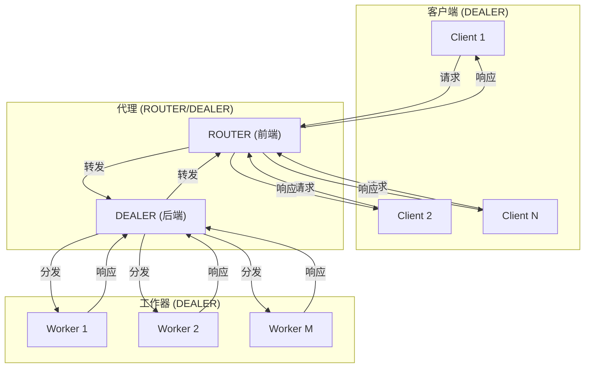

Ran tool
Read file: 01_zmq/router_dealer/worker.py
Ran tool
Read file: 01_zmq/router_dealer/broker.py
Read file: 01_zmq/router_dealer/client.py
初步分析如下：

1. client.py 使用 socket.send_string() 发送字符串消息，worker.py 使用 socket.recv_string() 接收字符串消息，理论上格式是匹配的。
2. broker.py 作为 ROUTER/DEALER 代理，直接用 zmq.proxy(frontend, backend) 转发消息，不做内容处理。

但在 ROUTER/DEALER 模式下，ZeroMQ 会自动在消息前加上路由 envelope（标识帧），导致 worker 端收到的并不是单一字符串帧，而是多帧消息（第一帧是身份，第二帧才是内容）。这时直接用 recv_string() 会出错，因为它只适用于单帧字符串。

解决思路：

- worker.py 需要用 recv_multipart() 接收多帧消息，然后取出内容帧再解码为字符串。
- 发送响应时也要带上 envelope。

下一步计划：

1. 修改 worker.py，使用 recv_multipart()，并正确处理 envelope 和内容帧。
2. 检查 client.py 是否也需要类似处理（一般 DEALER 端可以直接用 send_string/recv_string，但如果有 envelope 也要处理）。

你需要我直接帮你修改 worker.py 并给出修正建议吗？

# ROUTER/DEALER 模型说明

## 示意图

## 模型特性
- ROUTER/DEALER 组合实现了异步、可扩展的请求-响应分发。
- ROUTER 负责前端客户端的身份管理和消息路由，DEALER 负责后端工作器的负载均衡。
- 支持多客户端、多工作器，天然适合分布式、并发处理。
- 消息自动带有 envelope（身份帧），便于路由和响应。

## 典型使用场景
- 分布式任务调度系统（如分布式爬虫、批量数据处理）。
- 微服务架构中的异步任务分发。
- 需要高并发、可扩展的消息中转和负载均衡场景。

